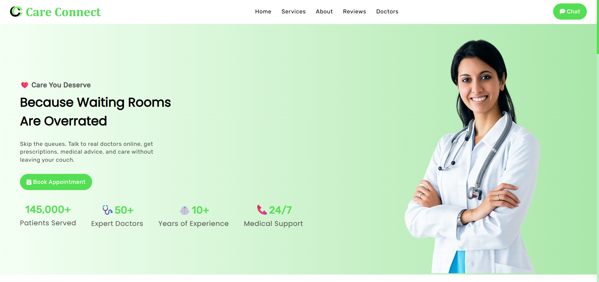
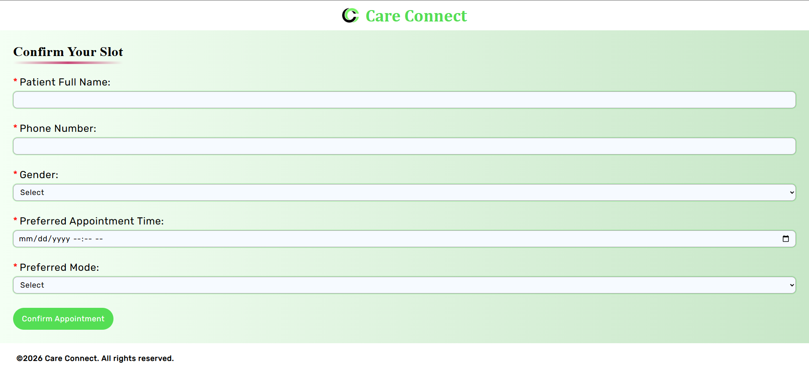
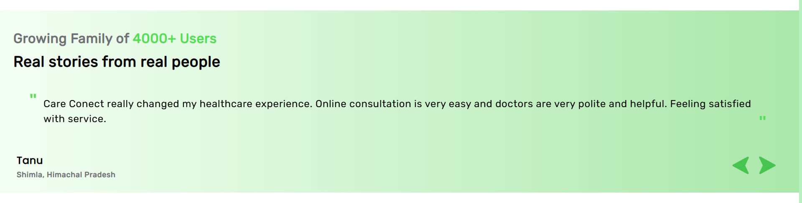
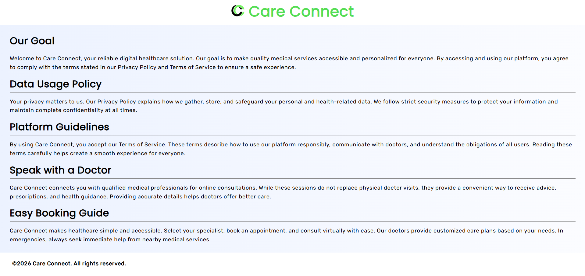
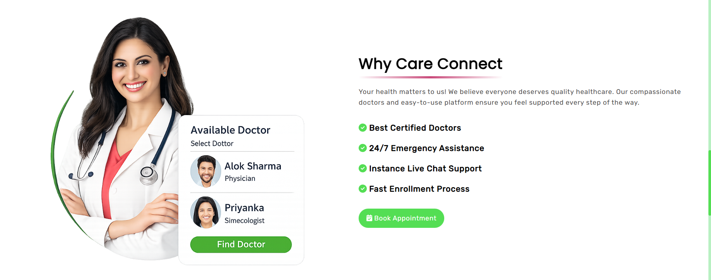
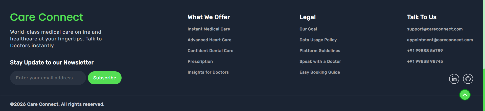

<h1 align="center">💚 Care-Connect</h1>

  A modern healthcare web application built with React.js.

  🚀 Clean UI | ⚡ Fast Navigation | 📅 Appointment Booking  

  🌐 Demo Link : 
<a href="https://hammad2412.github.io/Care-Connect/">https://hammad2412.github.io/Care-Connect/</a>

<h2>📌 About The Project</h2>

<strong>Care-Connect</strong> is a modern healthcare web platform designed to provide users
with a smooth and user-friendly experience.  
It allows patients to book medical appointments, access legal information, 
and navigate seamlessly across multiple pages using React Router.

---

<h2>✨ Features</h2>

<ul>
  <li>🏠 Home Page with modern UI</li>
  <li>📅 Appointment Booking system</li>
  <li>📱 Fully responsive design (Desktop and Phone)</li>
  <li>🔀 Client-side routing using React Router</li>
  <li>🧩 Reusable React components</li>
  <li>⚡ Fast performance & clean code</li>
  <li>📜 Legal information page</li>
  <li>❌ 404 Not Found page handling</li>
</ul>

---

<h2>🛠️ Tech Stack</h2>

<ul>
  <li><strong>Framework: </strong> ⚛️ React.js</li>
  <li><strong>Libraries: </strong>📦 React Router | React-Toastify | FontAwesomeIcon </li>
  <li>｡🇯‌🇸‌ JavaScript (ES6)</li>
  <li>🎨 CSS3</li>
</ul>

---

<h2>📂 Project Structure</h2>

<pre>
📁 care-connect
 ┣ 📁 screenshots
 ┣ 📁 src
 ┃ ┣ 📁 Assets
 ┃ ┣ 📁 Components
 ┃ ┃ ┣ 📁 About            => About.js, SolutionStep.js
 ┃ ┃ ┣ 📁 Appointment      => AppointmentForm.js
 ┃ ┃ ┣ 📁 BookAppointment  => BookAppointment.js
 ┃ ┃ ┣ 📁 Doctor           => DoctorCard.js, Doctors.js
 ┃ ┃ ┣ 📁 Footer           => Footer.js, SubscribeNewsletter.js
 ┃ ┃ ┣ 📁 Hero             => Hero.js
 ┃ ┃ ┣ 📁 Info             => Info.js, InformationCard.js
 ┃ ┃ ┣ 📁 Legal            => LegalDocs.js
 ┃ ┃ ┣ 📁 Navbar           => Navbar.js
 ┃ ┃ ┗ 📁 Reviews          => Reviews.js
 ┃ ┣ 📁 Pages              => Appointment.js, Home.js, Legal.js, NotFound.js 
 ┃ ┣ 📁 Scripts            => reviews.js
 ┃ ┣ App.css
 ┃ ┣ App.js
 ┃ ┗ index.js
 ┗ README.md
</pre>

---

<h2>📸 Screenshots</h2>

<h4>🏠 Home Page</h4>

<h4>📅 Appointment Page</h4>

<h4>🩺 Doctors Section</h4>

<h4>⭐ Reviews Section</h4>

<h4>📜 Legal Page</h4>

📷 More Screenshots

<h4>📱 Mobile View</h4>

<h4> About </h4>

<h4> Services </h4>

<h4> 🔗 Contact Info </h4>

## 

<h2>🚀 How To Run Locally</h2>

<pre>
git clone https://github.com/hammad2412/care-connect.git
cd care-connect
npm install
npm start
</pre>

---

<h2>👨‍💻 Author</h2>

<strong>Mohd Hammad Khan</strong> 
Frontend Developer | React | JS

<h3>🔗 Connect with me</h3>

<a href="https://www.linkedin.com/in/hammadkhan1224" target="_blank">
  
  LinkedIn 
</a>

<a href="https://github.com/hammad2412" target="_blank">
     
  GitHub
</a>

---

<strong>💚 Built with passion by Hammad</strong>

